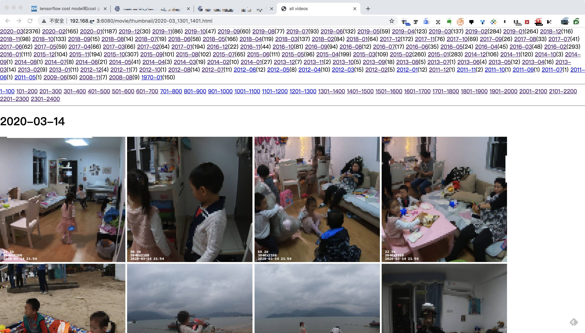

# tnas_video_web
铁威马NAS存储中的视频WEB服务，提供视频的搜索、去重、缩略图、WEB浏览等能力。

## 背景
小孩子出生以来拍了大量的视频，偶尔想拿出来重温，但是找起来很麻烦。
于是买了一个铁威马的NAS存储器，并且在上面写了一个python web站点，通过浏览器来浏览并观看视频。
可能也有其他人需要这样的工具，所以分享出来。

## 实现过程
1.在运行目录创建一个sqlite数据库文件；
2.设置要扫描的路径，存储到scan_paths表;
3.遍历这些目录下的所有文件，把文件信息存储到files表；
4.根据文件字节数和文件md5值，把重复的文件移动到制定的目录；
5.对所有视频文件输出封面帧，并把封面帧截取为300X300的缩略图；
6.在某个静态文件目录下，对视频文件建立软链接；
7.在铁威马的nginx配置文件中，把/movie/路径映射到静态文件目录；
8.在铁威马的nginx配置文件中，把/video/路径映射到http服务；
9.启动WEB站点，在浏览器中可以分月份浏览所有视频，并播放；

WEB页面的预览效果如下：


## 安装
### 基础依赖的组件
* [anaconda](https://www.anaconda.com/)
* python 3.6 和 pip3
* ffmpeg和ffprobe
* nginx

### 依赖的python库
* sqlite
* flask
* PIL
* exif

## 部署

### 安装库
```
#创建一个叫py3的 python3.6运行环境
conda create py3
conda activate py3
#安装各种python库
pip install flask
pip install pillow
pip install exif
```

### 修改nginx配置

cd /usr/local/nginx/conf
cp nginx.conf nginx.conf_20200324  #备份
vi nginx.conf
#增加以下内容：

```
        location /movie/ {
		    root /mnt/public/;
        }
	    location /video/ {
		    proxy_pass http://127.0.0.1:8081/video/;
	    }
```

#测试配置
nginx -t
#加载配置
nginx -s reload

### 执行
source bash activate_py3.sh
bash run.sh

## 查看
在浏览器中输入铁威马的地址和端口，后面加上 /video/ 路径
例如我的是：
http://192.168.1.3:8080/video/

Have fun!


